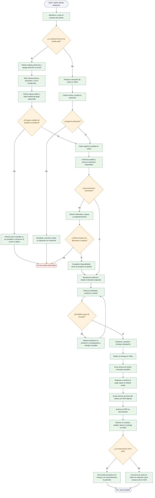

# QUETZALMART

## Manual 2 — Diagramas detallados de procesos

**Proyecto:** Implementación ERP y automatización de QuetzalMart  
**Versión:** 1.0  
**Fecha:** 30 de septiembre de 2026  
**Formato:** Markdown con diagramas Mermaid

---

## Propósito y alcance

Este manual representa, paso a paso, los procesos solicitados para UiPath, compras, ventas, movimiento y control de productos, y el recorrido omnicanal de un cliente. Los diagramas muestran las decisiones, validaciones, excepciones y registros que intervienen en cada flujo.

El ERP de referencia es Odoo. La automatización de UiPath trabaja mediante la interfaz de usuario de Odoo y la importación de archivos Excel; no utiliza la API de Odoo ni modifica directamente la base de datos. La tienda web registra sus pedidos en el ERP y envía eventos de navegación a GA4 cuando el visitante acepta las cookies correspondientes. Los pagos mostrados en pruebas son de demostración, no cobros reales.

Los tres almacenes —Guatemala, México y El Salvador— pertenecen a una misma compañía. Las ubicaciones y sectores de almacenamiento se eligen según la familia del producto y las reglas operativas definidas por QuetzalMart.

### Convenciones

- Los rectángulos representan actividades o registros.
- Los rombos representan decisiones.
- Las rutas rojas representan excepciones que deben resolverse antes de continuar.
- El flujo distingue los registros del ERP de las acciones realizadas por personas.
- Las facturas y los contratos archivados en Documentos son archivos del proyecto; un contrato de ejemplo no equivale a un contrato legal firmado.

---

## 1. Flujo de UiPath: carga de clientes, productos y existencias

El robot lee los libros de Excel preparados para la carga, valida su estructura y contenido, y utiliza las opciones de importación de Odoo. Si detecta un dato incompatible, el flujo debe detener la importación de ese conjunto para corregir el origen, en vez de continuar con registros inválidos.

```mermaid
flowchart TD
    A([Inicio]) --> B[Seleccionar carpeta de entrada]
    B --> C{¿Se encontraron archivos Excel?}
    C -- No --> X[Registrar que no hay archivos y finalizar]
    C -- Sí --> D[Leer archivos y hojas del libro]
    D --> E{¿La hoja requerida existe con el nombre exacto?}
    E -- No --> ER1[Detener ese archivo y reportar hoja faltante o mal nombrada]
    E -- Sí --> F{Tipo de carga}

    F -- Clientes --> G[Leer hoja clientes]
    G --> H[Omitir filas completamente vacías]
    H --> I[Validar encabezados y campos obligatorios]
    I --> J[Validar formato de datos y valores relacionados]
    J --> K{¿Hay errores de validación?}
    K -- Sí --> ER2[Reportar filas y campos; no importar el archivo]
    K -- No --> L[Abrir Odoo en Chrome y entrar a Contactos]
    L --> M[Abrir Importar y cargar el archivo preparado]
    M --> N[Relacionar columnas con campos de Odoo]
    N --> O[Ejecutar Probar]
    O --> P{¿La prueba de importación es válida?}
    P -- No --> ER3[Detener y reportar el error de Odoo]
    P -- Sí --> Q[Ejecutar Importar]
    Q --> R[Comprobar registros cargados en Contactos]

    F -- Productos --> S[Leer hoja productos]
    S --> T[Omitir filas completamente vacías]
    T --> U[Validar campos, tipo de producto y valores relacionados]
    U --> V{¿El producto es tipo servicio con cantidad física?}
    V -- Sí --> W[Omitir la cantidad a la mano para ese servicio]
    V -- No --> Y[Conservar los campos de inventario compatibles]
    W --> Z{¿Quedan errores de validación?}
    Y --> Z
    Z -- Sí --> ER4[Reportar filas y detener la carga de productos]
    Z -- No --> AA[Abrir Odoo en Chrome y entrar a Productos]
    AA --> AB[Preparar importación y gestionar el campo de seguimiento requerido]
    AB --> AC[Relacionar columnas y ejecutar Probar]
    AC --> AD{¿La prueba de importación es válida?}
    AD -- No --> ER5[Detener y reportar el error de Odoo]
    AD -- Sí --> AE[Ejecutar Importar]
    AE --> AF[Comprobar los productos cargados]

    R --> AH
    AF --> AG
    AG -- No --> AH[Finalizar y registrar resultado]
    AG -- Sí --> AI[Abrir Inventario y la lista de ajustes]
    AI --> AJ[Importar o revisar las cantidades contadas]
    AJ --> AK[Seleccionar Aplicar todo]
    AK --> AL[Escribir el motivo del ajuste sustituyendo Quantity Updated]
    AL --> AM[Seleccionar Actualizar cantidades]
    AM --> AN{¿Odoo confirmó el ajuste?}
    AN -- No --> ER6[Detener y revisar el mensaje o el ajuste pendiente]
    AN -- Sí --> AO[Verificar existencias actualizadas]
    AO --> AH

    AH --> AP([Fin])

    classDef process fill:#EAF5EA,stroke:#2F855A,color:#153B27,stroke-width:1px;
    classDef decision fill:#FFF2DD,stroke:#E67E22,color:#6B3A00,stroke-width:1px;
    classDef alert fill:#FDECEC,stroke:#C2410C,color:#7F1D1D,stroke-width:1px;
    classDef terminal fill:#F1F5F9,stroke:#64748B,color:#172033,stroke-width:1px;
    class B,D,G,H,I,J,L,M,N,O,Q,R,S,T,U,W,Y,AA,AB,AC,AE,AF,AI,AJ,AK,AL,AM,AO,AH process;
    class C,E,F,K,P,V,Z,AD,AG,AN decision;
    class ER1,ER2,ER3,ER4,ER5,ER6 alert;
    class A,AP,X terminal;
```

### Validaciones relevantes del robot

1. Los nombres de hoja deben coincidir exactamente con los esperados por el proceso (`clientes` y `productos`).
2. Las filas vacías no deben convertirse en registros.
3. Los campos obligatorios deben tener valores utilizables y los campos relacionados deben corresponder a opciones existentes en Odoo.
4. Un producto de tipo **Servicio** no debe recibir una cantidad a la mano; esa cantidad se omite para evitar un ajuste de existencias incompatible.
5. Las pruebas de importación se revisan antes de ejecutar la importación definitiva.
6. Para aplicar cantidades contadas, el motivo sustituye el texto predeterminado `Quantity Updated` y luego se confirma con **Actualizar cantidades**.
7. El robot no debe dar por exitosa una importación solo porque terminó la secuencia: también se revisa el resultado que presenta Odoo.

---

## 2. Flujo detallado de compras a proveedores

Una solicitud de cotización es una etapa previa a la compra. Para que exista una compra confirmada, la solicitud se confirma como orden de compra. La recepción se valida por separado y la factura del proveedor se crea, revisa y registra con referencia a esa compra. El pago de la factura es una operación posterior y no sustituye la creación de la factura.

```mermaid
flowchart TD
    A([Inicio: necesidad de abastecimiento]) --> B[Revisar demanda, existencias y punto de reorden]
    B --> C[Identificar productos, cantidades y almacén de destino]
    C --> D[Crear solicitudes de cotización para proveedores]
    D --> E[Comparar precio, disponibilidad, plazo y condiciones]
    E --> F{¿Se seleccionó una oferta?}
    F -- No --> G[Solicitar otra oferta o revisar la necesidad]
    G --> D
    F -- Sí --> H[Elegir proveedor y confirmar la solicitud]
    H --> I[Odoo genera la orden de compra]
    I --> J[Enviar o comunicar la orden al proveedor]
    J --> K[Proveedor prepara y entrega los productos]
    K --> L[Recibir en el almacén indicado]
    L --> M[Comparar orden, documento de entrega y cantidades recibidas]
    M --> N[Inspeccionar estado, lote y vencimiento cuando aplique]
    N --> O{¿La recepción es correcta?}
    O -- No --> P[Separar unidades faltantes, dañadas o no conformes]
    P --> Q[Registrar incidencia y acordar devolución, reemplazo o nota de crédito]
    Q --> R{¿Hay unidades aceptables?}
    R -- No --> S[Dejar la recepción pendiente de resolución]
    R -- Sí --> T[Validar únicamente las unidades aceptadas]
    O -- Sí --> T
    T --> U[Odoo actualiza la recepción y las existencias del almacén]
    U --> V[Crear factura de proveedor desde la orden o recepción]
    V --> W[Comparar proveedor, referencia, líneas, cantidades, impuestos y total]
    W --> X{¿La factura coincide con la compra?}
    X -- No --> Y[Corregir borrador o solicitar aclaración al proveedor]
    Y --> W
    X -- Sí --> Z[Registrar la factura de proveedor]
    Z --> AA[Conservar el PDF y archivarlo en Documentos]
    AA --> AB{¿Se pagará ahora?}
    AB -- Sí --> AC[Registrar el pago según las condiciones acordadas]
    AB -- No --> AD[Dejar la cuenta por pagar pendiente con su vencimiento]
    AC --> AE[Verificar vínculo entre compra, recepción y factura]
    AD --> AE
    AE --> AF([Fin])
    S --> AG([Seguimiento de incidencia])

    classDef process fill:#EAF5EA,stroke:#2F855A,color:#153B27,stroke-width:1px;
    classDef decision fill:#FFF2DD,stroke:#E67E22,color:#6B3A00,stroke-width:1px;
    classDef alert fill:#FDECEC,stroke:#C2410C,color:#7F1D1D,stroke-width:1px;
    classDef terminal fill:#F1F5F9,stroke:#64748B,color:#172033,stroke-width:1px;
    class B,C,D,E,G,H,I,J,K,L,M,N,P,Q,T,U,V,W,Y,Z,AA,AC,AD,AE process;
    class F,O,R,X,AB decision;
    class S alert;
    class A,AF,AG terminal;
```

### Controles del proceso de compra

- **Solicitud de cotización:** permite comparar propuestas; por sí sola no acredita una compra realizada.
- **Orden de compra:** evidencia que la propuesta fue confirmada y que se formalizó el pedido en Odoo.
- **Recepción:** confirma qué cantidades llegaron efectivamente y en qué almacén.
- **Factura de proveedor:** se revisa contra las líneas y cantidades de la compra antes de registrarla.
- **Archivo:** el PDF se conserva en la categoría de Documentos correspondiente para su consulta posterior.
- **Pago:** puede quedar pendiente; el estado de pago debe mostrarse como tal y no confundirse con el estado de la orden o de la factura.

---

## 3. Flujo detallado de ventas de productos

Este flujo aplica a una venta registrada en Odoo, ya sea originada por una cotización comercial o por el pedido confirmado desde el comercio electrónico. Los pasos de preparación y entrega reflejan la operación de inventario; la forma concreta de entrega depende del pedido.

### Registros que permiten seguir una venta

La trazabilidad se construye relacionando el contacto, la cotización u orden, la entrega y la factura. Para una venta web se añade el evento de compra de GA4 cuando el navegador pudo enviarlo. La presencia del pedido en Odoo no garantiza por sí sola que GA4 haya recibido o procesado el evento.

---

## 4. Flujo del producto: recepción, almacenamiento, control y venta

Este flujo cubre el ciclo físico del artículo. La ubicación se determina por el almacén y el sector que correspondan. Los productos dañados o vencidos se separan de las existencias vendibles para evitar que se reserven o aparezcan disponibles para clientes.

```mermaid
flowchart TD
    A([Producto solicitado al proveedor]) --> B[Confirmar orden de compra y almacén de destino]
    B --> C[Recibir bultos y contar unidades]
    C --> D[Comparar entrega con la orden y los documentos del proveedor]
    D --> E[Inspeccionar empaque, integridad, lote y vencimiento cuando aplique]
    E --> F{¿Producto apto y cantidad correcta?}
    F -- No --> G[Identificar y separar unidades dañadas, vencidas o discrepantes]
    G --> H[Marcar como no disponibles para venta y documentar incidencia]
    H --> I{¿Se acepta devolución, reemplazo o ajuste?}
    I -- Sí --> J[Gestionar con proveedor devolución, reemplazo o nota de crédito]
    I -- No --> K[Escalar al responsable y mantener en cuarentena]
    J --> L[Actualizar la recepción con las cantidades aceptadas]
    K --> L
    F -- Sí --> L
    L --> M[Validar recepción y actualizar existencias en Odoo]
    M --> N[Clasificar por familia, conservación, rotación y almacén]
    N --> O[Asignar sector o ubicación interna definida]
    O --> P[Almacenar con identificación y condiciones apropiadas]
    P --> Q[Actualizar disponibilidad para ventas y tienda web]
    Q --> R[Realizar conteos cíclicos y revisar movimientos]
    R --> S{¿Conteo físico coincide con Odoo?}
    S -- No --> T[Investigar movimientos, mermas y errores de registro]
    T --> U[Documentar motivo y aprobar ajuste de inventario]
    U --> V[Actualizar cantidades y comprobar saldo resultante]
    V --> Q
    S -- Sí --> W[Conservar saldo y continuar el control periódico]
    W --> X{¿Hay un pedido o reposición de tienda?}
    X -- No --> R
    X -- Sí --> Y[Reservar y recolectar unidades del sector correcto]
    Y --> Z[Empacar según tipo de producto y pedido]
    Z --> AA[Revisar producto, cantidad, estado y destino antes de liberar]
    AA --> AB{¿Pasa el control final?}
    AB -- No --> AC[Retener, sustituir o volver a preparar el pedido]
    AC --> Y
    AB -- Sí --> AD[Entregar al cliente o despachar el pedido]
    AD --> AE[Registrar salida y descontar existencias en Odoo]
    AE --> AF[Si fue venta web, cerrar el pedido y emitir la factura]
    AF --> AG([Fin: producto vendido y movimiento trazable])

    classDef process fill:#EAF5EA,stroke:#2F855A,color:#153B27,stroke-width:1px;
    classDef decision fill:#FFF2DD,stroke:#E67E22,color:#6B3A00,stroke-width:1px;
    classDef alert fill:#FDECEC,stroke:#C2410C,color:#7F1D1D,stroke-width:1px;
    classDef terminal fill:#F1F5F9,stroke:#64748B,color:#172033,stroke-width:1px;
    class B,C,D,E,G,H,J,K,L,M,N,O,P,Q,R,T,U,V,W,Y,Z,AA,AC,AD,AE,AF process;
    class F,I,S,X,AB decision;
    class G,H,K,AC alert;
    class A,AG terminal;
```

### Reglas operativas de inventario

- No mezclar producto aceptado con producto en cuarentena.
- Registrar la recepción en el almacén que corresponda; luego, ubicar el artículo en el sector definido para su familia y conservación.
- Corregir una diferencia de inventario solo después de investigar y dejar un motivo del ajuste.
- Revisar el estado del producto antes de empacar y antes de entregarlo.
- La disponibilidad de la tienda web depende del inventario y de la configuración de publicación del producto en Odoo.

---

## 5. Recorrido del cliente: visita a tienda y compra en línea

El diagrama describe un recorrido omnicanal: el cliente visita una tienda física, consulta la disponibilidad y puede completar después su pedido en el portal. La visita física por sí sola no genera una compra web ni un evento `purchase` de GA4. Si la operación presencial se registra en Odoo, queda en el ERP; el evento de comercio electrónico corresponde al flujo del sitio web.

```mermaid
flowchart TD
    A([Cliente descubre QuetzalMart]) --> B[Visita una sucursal física]
    B --> C[Explora productos y consulta a un colaborador]
    C --> D[Colaborador consulta producto y disponibilidad en Odoo]
    D --> E{¿Hay existencias en esa sucursal?}
    E -- Sí --> F[Cliente revisa el producto y decide]
    E -- No --> G[Consultar otro almacén o informar disponibilidad estimada]
    G --> F
    F --> H{¿Compra presencialmente?}
    H -- Sí --> I[Registrar la venta por el flujo de ventas disponible]
    I --> J[Preparar, cobrar y entregar según el proceso presencial]
    J --> K[Conservar pedido y factura en Odoo si se generó]
    K --> L[El recorrido físico no se cuenta como purchase web en GA4]
    L --> Z([Fin del recorrido presencial])

    H -- No, compra después en línea --> M[Cliente abre la tienda web]
    M --> N{¿Acepta cookies de medición?}
    N -- Sí --> O[GA4 puede medir la navegación de la sesión]
    N -- No --> P[La tienda sigue disponible; la medición puede ser limitada]
    O --> Q[Ver producto: view_item si la medición está permitida]
    P --> Q
    Q --> R[Agregar producto al carrito: add_to_cart si la medición está permitida]
    R --> S{¿Continúa al proceso de pago?}
    S -- No --> T[Carrito queda sin compra; puede alimentar el análisis de abandono]
    T --> Z2([Fin sin compra web])
    S -- Sí --> U[Iniciar checkout: begin_checkout]
    U --> V[Ingresar datos de contacto, entrega y método de pago]
    V --> W[Odoo calcula total, impuestos y envío configurado]
    W --> X{¿Pedido y pago de prueba se confirman?}
    X -- No --> Y[Mostrar estado no completado; no contabilizar purchase]
    Y --> Z2
    X -- Sí --> AA[Odoo crea el pedido de venta y reserva existencias]
    AA --> AB[Preparar y validar la entrega]
    AB --> AC[Crear la factura de cliente]
    AC --> AD[Enviar confirmación y factura al correo registrado]
    AD --> AE[Guardar el PDF de la factura en Documentos]
    AE --> AF[Asociar actividad y pedido al contacto del CRM]
    AF --> AG[GA4 recibe purchase e ingresos si la etiqueta y consentimiento lo permiten]
    AG --> AH[Después de la compra, responsable envía la campaña a la audiencia seleccionada]
    AH --> AI[Comprobar en Mailpit los mensajes de prueba y sus asuntos]
    AI --> AJ([Fin: compra web con trazabilidad])

    classDef process fill:#EAF5EA,stroke:#2F855A,color:#153B27,stroke-width:1px;
    classDef decision fill:#FFF2DD,stroke:#E67E22,color:#6B3A00,stroke-width:1px;
    classDef alert fill:#FDECEC,stroke:#C2410C,color:#7F1D1D,stroke-width:1px;
    classDef terminal fill:#F1F5F9,stroke:#64748B,color:#172033,stroke-width:1px;
    class B,C,D,F,G,I,J,K,L,M,O,P,Q,R,T,U,V,W,Y,AA,AB,AC,AD,AE,AF,AG,AH,AI process;
    class E,H,N,S,X decision;
    class T,Y alert;
    class A,Z,Z2,AJ terminal;
```

### Qué se demuestra en cada sistema

| Evidencia | Dónde se consulta | Qué permite comprobar |
|---|---|---|
| Contacto y relación comercial | Odoo CRM / Contactos | Identidad del cliente y actividades asociadas. |
| Pedido de venta | Odoo Ventas | Productos, cantidades, estado, cliente y total. |
| Disponibilidad y entrega | Odoo Inventario | Reserva, almacén, movimiento y validación de salida. |
| Factura electrónica en PDF | Odoo Facturación y Documentos | Documento emitido y archivo conservado. |
| Eventos de comercio electrónico | GA4 | Navegación y pasos del checkout que la etiqueta recibió. |
| Mensajes de prueba | Mailpit local | Mensajes generados por Odoo en el entorno de prueba; no acredita entrega a una bandeja pública de Gmail. |

---

## Cierre

Los diagramas separan las etapas que suelen confundirse: cotización frente a orden confirmada; orden de compra frente a recepción; factura creada frente a factura pagada; visita a una sucursal frente a compra web; y pedido registrado en Odoo frente a evento efectivamente procesado por GA4. Para una demostración, conviene seguir las flechas según el caso, abrir el registro correspondiente en Odoo y mostrar la evidencia del sistema indicado en la tabla.

