# QUETZALMART

## Manual 3 — Inteligencia de negocios con Google Analytics 4

**Proyecto:** Implementación ERP y comercio electrónico  
**Versión:** 1.2  
**Actualizado:** 2 de octubre de 2026  
**Propiedad analizada:** QuetzalMart Web 2026  
**Moneda:** Quetzales (Q)

---

## 1. Resumen ejecutivo

Este manual presenta una lectura de negocio construida con los informes y exploraciones visibles en la propiedad GA4 de QuetzalMart. La vista principal usa el periodo **4 de septiembre–1 de octubre de 2026** (últimos 28 días disponibles al consultar el informe). Las exploraciones guardadas muestran el periodo **27 de septiembre–2 de octubre de 2026**. El resultado diario de campaña se identifica aparte como corte del **30 de septiembre**. Las cifras de ventanas diferentes no se suman ni se comparan como si fueran una sola medición.

En el periodo principal GA4 presenta **37 sesiones**, **482 eventos** y **Q404,91 de ingresos totales**. El evento <code>purchase</code> aparece **10 veces**, asociado con **4 usuarios**. El informe de comercio electrónico muestra **15 artículos comprados** y **Q227,23 de ingresos por artículo**; este importe no coincide con los ingresos totales del evento <code>purchase</code>, por lo que se deja visible como una diferencia pendiente de conciliación.

La propiedad registra los cuatro eventos de comercio electrónico requeridos: <code>view_item</code>, <code>add_to_cart</code>, <code>begin_checkout</code> y <code>purchase</code>. También hay tres segmentos de usuarios, cinco segmentos de eventos y dos exploraciones guardadas. Ambas exploraciones muestran datos. La segunda identifica **5 usuarios** que agregaron un producto, **4** que completaron compra y **1 abandono (20 %)** para su periodo propio.

### Indicadores destacados

| Indicador | Resultado observado | Alcance |
|---|---:|---|
| Sesiones | 37 | Adquisición de tráfico, últimos 28 días |
| Sesiones con interacción | 17 (45,95 %) | Tasa de interacción mostrada por GA4 |
| Eventos | 482 | Informe de adquisición y de eventos |
| Eventos clave | 10 | Total de eventos marcados como clave; no equivale necesariamente a 10 compras |
| Tasa de evento clave por sesión | 18,92 % | Incluye todos los eventos clave configurados |
| Ingresos totales | Q404,91 | Métrica de ingresos totales de GA4 |
| Eventos <code>purchase</code> | 10 | Informe de eventos |
| Usuarios con <code>purchase</code> | 4 de 7 usuarios activos | **57,14 % calculado**: usuarios con compra ÷ usuarios activos; no es la tasa de conversión por sesión de GA4 |
| Artículos comprados | 15 | Informe Compras en comercio electrónico |
| Ingresos por artículo | Q227,23 | Suma del informe de artículos; distinta de ingresos totales |

> **Lectura principal:** existe actividad y hay compras registradas en GA4. La tasa de evento clave no debe presentarse como tasa de compra: para la proporción de compradores se indica expresamente el cálculo por usuario. La exploración de embudo ya permite medir el abandono en su propio periodo.

---

## 2. Adquisición de usuarios y generación de ingresos

En **Informes → Adquisición → Adquisición de tráfico**, con la dimensión **Grupo de canales principal de la sesión (Grupo de canales predeterminado)**, el total de sesiones se desglosa en Email, Direct y Unassigned. Las filas concilian con el total de 37 sesiones y con Q404,91 de ingresos.

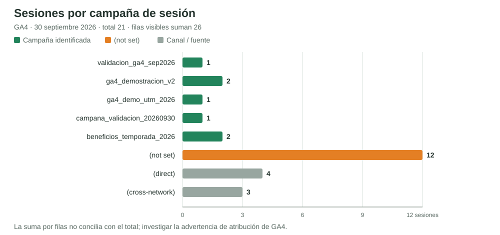

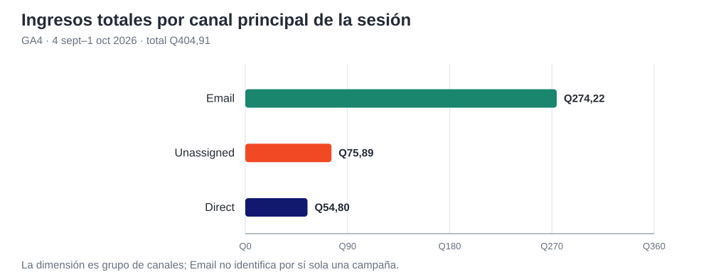

| Canal principal de sesión | Sesiones | Sesiones con interacción | Eventos | Eventos clave | Tasa de evento clave de sesión | Ingresos totales |
|---|---:|---:|---:|---:|---:|---:|
| Email | 15 | 6 | 210 | 5 | 26,67 % | Q274,22 |
| Direct | 14 | 10 | 194 | 4 | 14,29 % | Q54,80 |
| Unassigned | 8 | 1 | 78 | 1 | 12,50 % | Q75,89 |
| **Total** | **37** | **17** | **482** | **10** | **18,92 %** | **Q404,91** |

**Interpretación.** El canal Email concentra Q274,22 (67,72 % de los ingresos totales mostrados en esta tabla), seguido por Unassigned con Q75,89 y Direct con Q54,80. “Email” es un grupo de canales, no el nombre de una campaña específica; por sí solo no demuestra qué enlace o campaña generó cada compra. Un evento clave puede ser <code>purchase</code> u otro evento marcado como clave, así que su tasa se conserva con el nombre usado por GA4.

---

## 3. Eventos del comercio electrónico y conversión

El informe **Eventos**, con el mismo periodo principal, registra los siguientes eventos. La columna de usuarios corresponde a usuarios que activaron cada evento; el número de eventos puede repetirse para una misma persona.

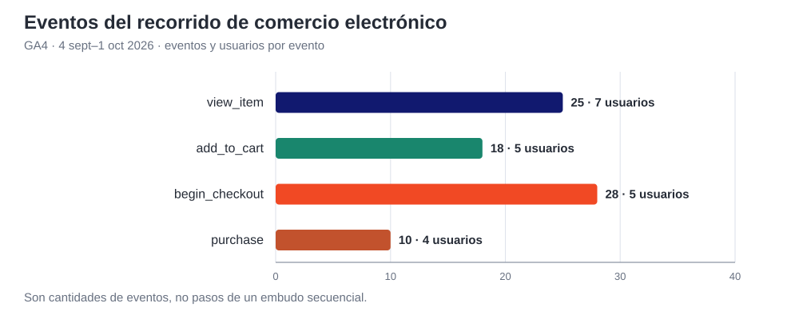

| Evento | Número de eventos | Usuarios |
|---|---:|---:|
| <code>view_item</code> | 25 | 7 |
| <code>add_to_cart</code> | 18 | 5 |
| <code>begin_checkout</code> | 28 | 5 |
| <code>purchase</code> | 10 | 4 |

### Tasa de conversión presentada

Con las métricas visibles del informe de eventos se calcula una tasa de conversión **a nivel de usuarios activos**:

**4 usuarios con <code>purchase</code> ÷ 7 usuarios activos = 57,14 %.**

Este cálculo indica la proporción de usuarios activos que registró al menos un <code>purchase</code> en el periodo. No es la tasa de conversión por sesión ni la tasa de evento clave que muestra Adquisición de tráfico (18,92 %), pues esa tasa incluye todos los eventos clave. Al exponerlo, se debe nombrar el numerador, el denominador y el periodo.

Los conteos de eventos no forman por sí solos un embudo secuencial: una persona puede ver o agregar varios artículos y activar varias veces <code>begin_checkout</code>. Para cuantificar conversiones entre etapas o abandonos se necesitan datos de usuarios/sesiones en una exploración de embudo poblada.

---

## 4. Productos más vendidos

En **Informes → Generar ventas → Compras en comercio electrónico**, GA4 muestra vistas, adiciones al carrito, artículos comprados e ingresos por artículo para el periodo principal.

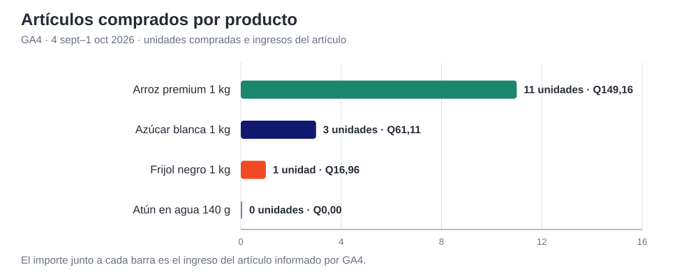

| Producto | Vistos | Añadidos al carrito | Comprados | Ingresos del artículo |
|---|---:|---:|---:|---:|
| Arroz premium 1 kg | 22 | 16 | **11** | **Q149,16** |
| Azúcar blanca 1 kg | 2 | 2 | **3** | **Q61,11** |
| Frijol negro 1 kg | 0 | 0 | **1** | **Q16,96** |
| Atún en agua 140 g | 1 | 0 | 0 | Q0,00 |
| **Total** | **25** | **18** | **15** | **Q227,23** |

**Hallazgo.** El arroz premium lidera por unidades e ingresos del artículo: 11 unidades y Q149,16. El total de ingresos por artículo (Q227,23) difiere en **Q177,68** de los Q404,91 de ingresos totales mostrados por GA4 para el mismo periodo. Se muestran ambos valores sin mezclarlos; antes de usarlos como una conciliación contable habría que revisar los parámetros de los eventos de compra y la composición de cada métrica en GA4.

---

## 5. Campaña identificada: lectura independiente del corte de 28 días

El informe **Adquisición de tráfico → Campaña de la sesión**, filtrado para el **30 de septiembre de 2026**, muestra la campaña <code>beneficios_temporada_2026</code>. Este es un corte de un solo día, separado de los indicadores de los últimos 28 días.

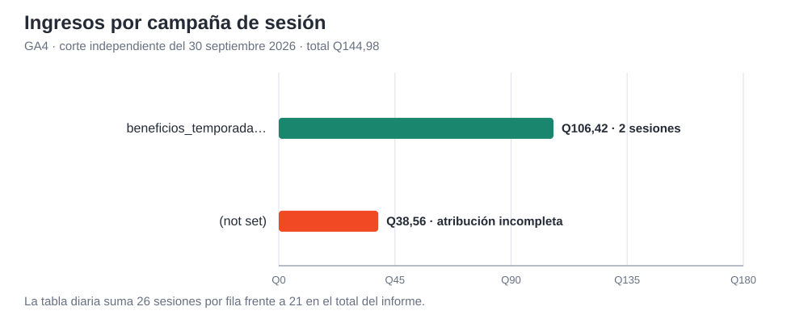

| Fila de campaña del 30 de septiembre | Sesiones mostradas | Eventos clave | Ingresos |
|---|---:|---:|---:|
| <code>beneficios_temporada_2026</code> | 2 | 1 | Q106,42 |
| <code>(not set)</code> | 12 | 1 | Q38,56 |
| **Total del informe** | **21** | **2** | **Q144,98** |

El corte muestra ingreso asociado a una campaña identificada. Sin embargo, la tabla vista agrupa el conteo en **Eventos clave** y no especifica en esa fila cuál fue el nombre del evento; por ello, no se afirma que el evento clave atribuido a esta campaña haya sido específicamente <code>purchase</code> sin abrir su desglose por nombre.

### Control de calidad de atribución

En el mismo informe diario, las ocho filas visibles suman **26 sesiones**, aunque el total indica **21**. GA4 también muestra una advertencia relacionada con la atribución <code>(not set)</code>. Por tanto, la campaña y sus ingresos se reportan como valores visibles de ese corte, pero las filas de sesiones no se utilizan como un reparto reconciliado. Esta advertencia no debe ocultarse ni extrapolarse a todos los periodos.

---

## 6. Segmentos, audiencias y exploraciones

### Segmentos de usuarios

La exploración guardada **Exploracion 1 - Segmentos de usuarios**, para el periodo **27 de septiembre–2 de octubre**, compara tres segmentos y sí muestra usuarios activos:

| Segmento de usuarios | Usuarios activos |
|---|---:|
| Usuarios con visualizacion de producto | 7 |
| Usuarios con carrito | 5 |
| Usuarios compradores | 4 |

La tabla de la exploración también permite ver el dispositivo y la ciudad registrados para esos segmentos. Las cifras son pertenencia a cada segmento; no deben sumarse entre sí como usuarios únicos de toda la tienda.

### Segmentos de eventos

En la propiedad están disponibles cinco segmentos de eventos relacionados con el recorrido:

1. Evento <code>view_item</code>
2. Evento <code>add_to_cart</code>
3. Evento <code>begin_checkout</code>
4. Evento <code>purchase</code>
5. Evento <code>session_start</code>

### Audiencias

La configuración del proyecto incluye, entre otras, estas tres audiencias:

| Audiencia | Tipo / propósito |
|---|---|
| GA4 sugerida - Vistas de producto | Audiencia sugerida de usuarios que vieron productos |
| GA4 sugerida - Checkout sin compra | Audiencia sugerida para seguimiento de usuarios que iniciaron checkout |
| GA4 personalizada - Visitantes sin compra | Audiencia personalizada para visitantes que no registraron compra |

El informe de una audiencia y la exploración de un segmento no son el mismo elemento: una audiencia debe mostrarse desde la sección **Audiencias** y sus datos de pertenencia pueden tardar en acumularse.

---

## 7. Embudo y abandono del carrito: estado actual

La segunda exploración guardada se titula **Exploración 2 - Eventos y abandono de carrito**. Su paso configurado es **Agrega producto al carrito → Compra completada**, en modo de embudo estándar, para el periodo **27 de septiembre–2 de octubre de 2026**.

La tabla de resultados verificada el **2 de octubre** muestra **5 usuarios** en el primer paso, **4 (80 %)** en compra completada y **1 abandono (20 %)**. Es una medición secuencial del embudo, no una resta de cantidades generales de eventos. Estas cifras pertenecen solo al periodo de la exploración y pueden actualizarse cuando GA4 procese sesiones nuevas.

---

## 8. Lectura ejecutiva y acciones recomendadas

1. **Adquisición:** Email presenta el mayor ingreso observado en el periodo principal (Q274,22); distinguir el canal Email de la campaña etiquetada.
2. **Productos:** el arroz premium es el producto con más unidades compradas (11) y más ingresos por artículo (Q149,16).
3. **Conversión:** la tasa calculada de compradores sobre usuarios activos es 57,14 %; nombrarla como métrica por usuario, no como tasa por sesión.
4. **Atribución:** la campaña <code>beneficios_temporada_2026</code> registra Q106,42 en el corte diario del 30 de septiembre, pero el conteo mostrado es de eventos clave y la tabla tiene una diferencia en el total de sesiones.
5. **Calidad de ingresos:** reconciliar los Q404,91 de ingresos totales con los Q227,23 de ingresos por artículo antes de interpretar la diferencia como venta neta o margen.
6. **Abandono:** la exploración muestra 1 de 5 usuarios que agregó al carrito sin completar la compra (20 %) en el periodo 27 sept–2 oct.

---

## 9. Guía de presentación

1. En GA4, seleccionar la propiedad **QuetzalMart Web 2026**.
2. En **Informes → Adquisición → Adquisición de tráfico**, elegir **4 sept–1 oct 2026** y mostrar sesiones, ingresos y la dimensión de grupo de canales.
3. En **Informes → Ver la interacción y la retención de usuarios → Eventos**, mostrar <code>view_item</code>, <code>add_to_cart</code>, <code>begin_checkout</code> y <code>purchase</code>.
4. En **Informes → Generar ventas → Compras en comercio electrónico**, mostrar el ranking de artículos y las métricas de vistos, añadidos y comprados.
5. En **Explorar**, abrir la primera exploración y señalar la comparación 7 / 5 / 4; después abrir la segunda y mostrar los 5 usuarios que agregaron al carrito, 4 que compraron y 1 abandono (20 %).
6. Para la campaña, seleccionar el corte **30 sept 2026**, buscar <code>beneficios_temporada_2026</code> y aclarar la advertencia de <code>(not set)</code> y la diferencia en la suma de sesiones.
7. Si se presenta la tasa de 57,14 %, explicar su fórmula: 4 usuarios con <code>purchase</code> ÷ 7 usuarios activos en el periodo principal.
8. Contrastar GA4 con Odoo para comprobar pedidos y facturas; GA4 mide actividad web y atribución, no sustituye el registro comercial del ERP.

### Definiciones

- **Ingresos totales:** métrica agregada de ingresos mostrada por GA4.
- **Ingresos del artículo:** ingresos atribuidos a los productos individuales en el informe de comercio electrónico.
- **Evento clave:** evento marcado como importante en GA4; la tasa puede incluir varios nombres de evento.
- **Usuarios activos:** usuarios que GA4 considera activos durante el periodo seleccionado.
- **Tasa calculada de compradores:** usuarios con evento <code>purchase</code> ÷ usuarios activos; se identifica como cálculo propio a nivel de usuario.
- **Abandono de carrito:** usuario/sesión que activa <code>add_to_cart</code> y no completa <code>purchase</code> según la secuencia definida en el embudo. No puede calcularse con los totales generales de eventos.

---

## Anexo — gráficos

Los gráficos vectoriales están en manual_3/graficos/. Los gráficos 1–4 reflejan los últimos 28 días disponibles (4 de septiembre–1 de octubre de 2026); el gráfico 5 corresponde únicamente al 30 de septiembre de 2026. Mantener esta carpeta junto al Markdown al convertirlo a PDF.

---

## Anexo A - Capturas de Google Analytics 4

**Propiedad:** QuetzalMart Web 2026. **Capturado:** 6 de octubre de 2026.

Este anexo conserva el contenido anterior y añade capturas reales de los informes correspondientes. Los periodos son 4 sept-1 oct 2026 para los informes principales, 30 sept 2026 para campaña y 27 sept-2 oct 2026 para exploraciones. Las tablas nativas respaldan las cifras usadas para elaborar los gráficos del manual.

**Diferencia en el corte de campaña:** la consulta actual del 30 de septiembre muestra 27 sesiones y Q350,11; beneficios_temporada_2026 figura con Q222,10. El manual conserva 21 sesiones, Q144,98 y Q106,42 de su consulta original. No se atribuye esta diferencia a una causa no comprobada.

**Exploraciones:** se consultaron copias personales con el periodo histórico. Las definiciones de los segmentos y pasos de las exploraciones compartidas permanecen intactas. La primera copia usa la vista Tabla. Las audiencias se muestran por separado, con su propia ventana de pertenencia.

### A01 - Adquisición: sesiones por canal

**Sección:** 01 / Adquisición. **Periodo:** 4 sept–1 oct 2026.

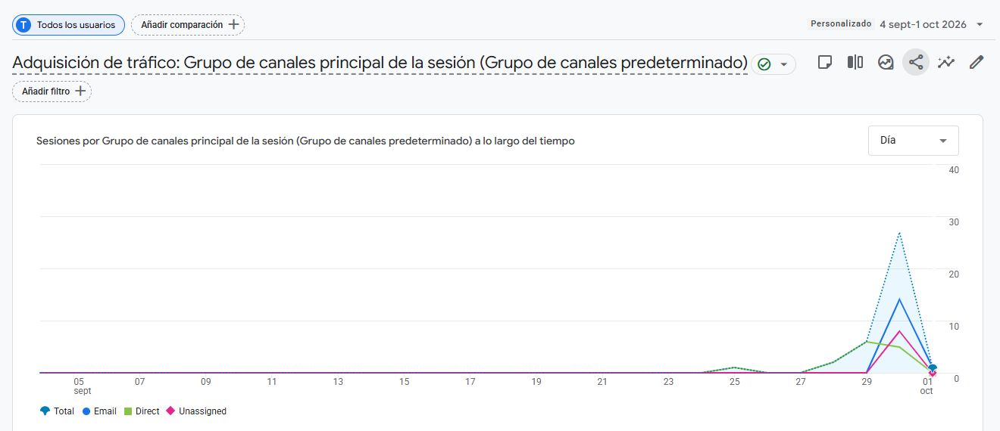

Gráfica temporal original de GA4; respalda las 37 sesiones y el desglose por canal.

### A02 - Adquisición: desglose de sesiones

**Sección:** 01 / Adquisición. **Periodo:** 4 sept–1 oct 2026.

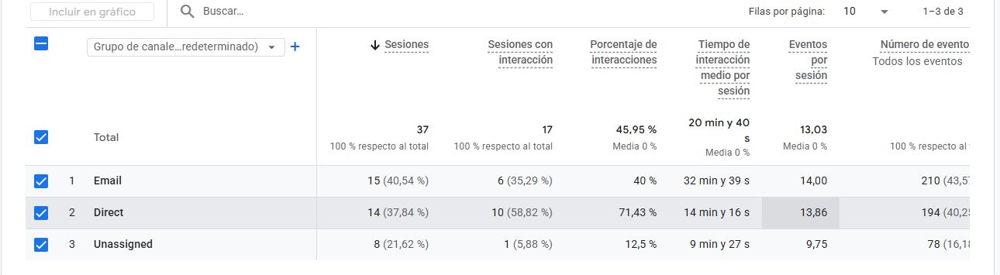

Tabla de canales: Email 15, Direct 14 y Unassigned 8; total 37 sesiones.

### A03 - Adquisición: eventos e ingresos por canal

**Sección:** 01 / Adquisición. **Periodo:** 4 sept–1 oct 2026.

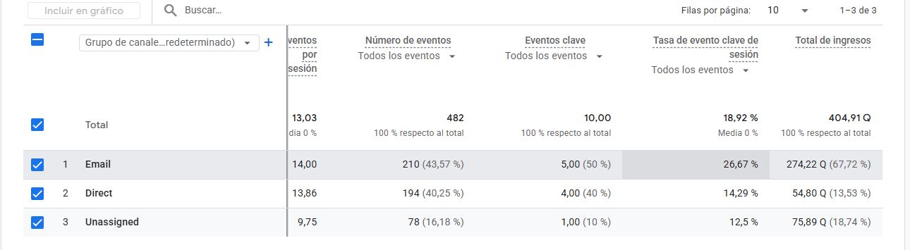

Respaldo del gráfico de ingresos del manual: Email Q274,22; Direct Q54,80; Unassigned Q75,89; total Q404,91.

### A04 - Eventos: las cuatro series del comercio electrónico

**Sección:** 02 / Comercio electrónico. **Periodo:** 4 sept–1 oct 2026.

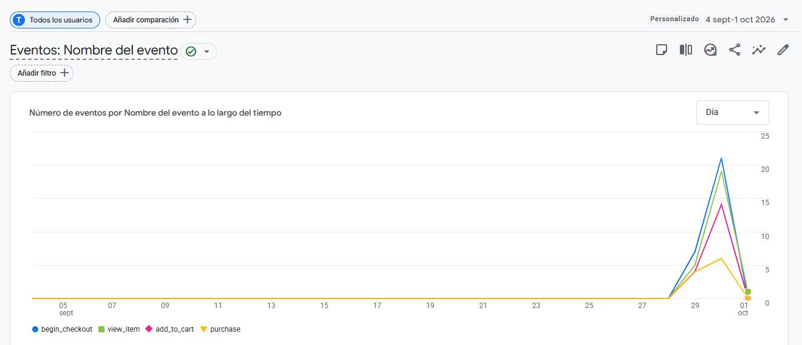

Gráfica nativa de view_item, add_to_cart, begin_checkout y purchase; se seleccionaron esas cuatro filas para visualizar sus series.

### A05 - Eventos: cantidades y usuarios

**Sección:** 02 / Comercio electrónico. **Periodo:** 4 sept–1 oct 2026.

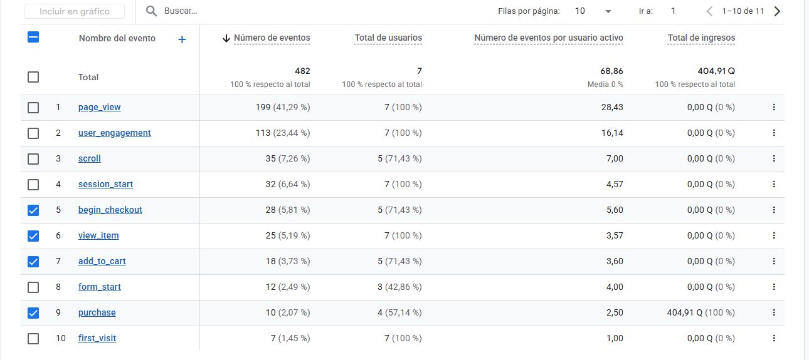

Coincide con el manual: view_item 25/7 usuarios; add_to_cart 18/5; begin_checkout 28/5; purchase 10/4. El total de usuarios es 7; respalda la proporción calculada 4/7 = 57,14 %. 

### A06 - Productos: actividad por artículo

**Sección:** 03 / Productos. **Periodo:** 4 sept–1 oct 2026.

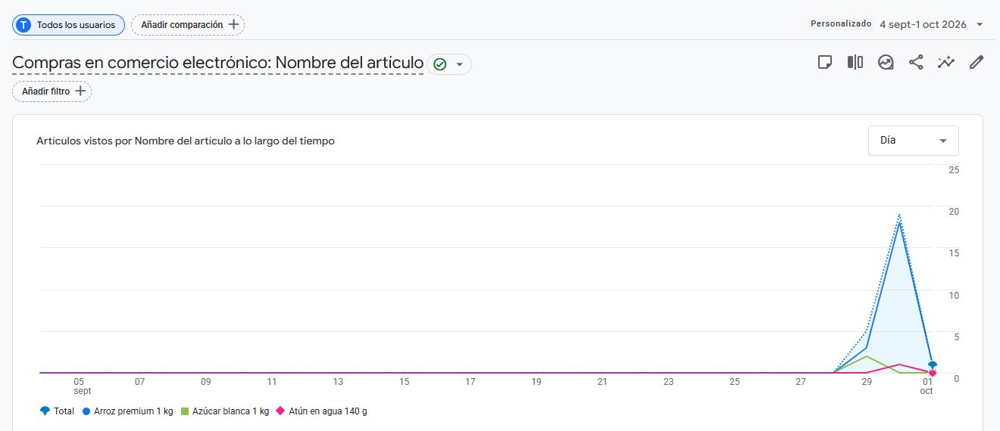

Gráfica temporal nativa de artículos vistos. La tabla siguiente respalda el gráfico de artículos comprados e ingresos del manual.

### A07 - Productos: unidades e ingresos por artículo

**Sección:** 03 / Productos. **Periodo:** 4 sept–1 oct 2026.

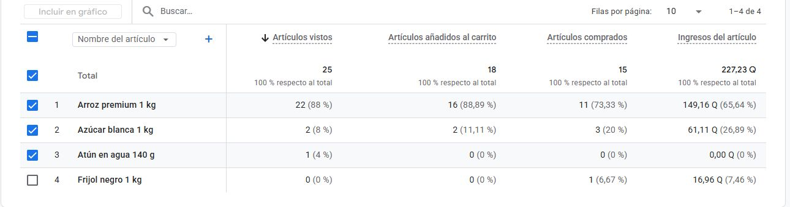

Coincide con el manual: arroz 11/Q149,16; azúcar 3/Q61,11; frijol 1/Q16,96; total 15 artículos/Q227,23. El orden de la tabla nativa se basa en artículos vistos.

### A08 - Campaña: corte diario original

**Sección:** 04 / Campaña identificada. **Periodo:** 30 sept 2026.

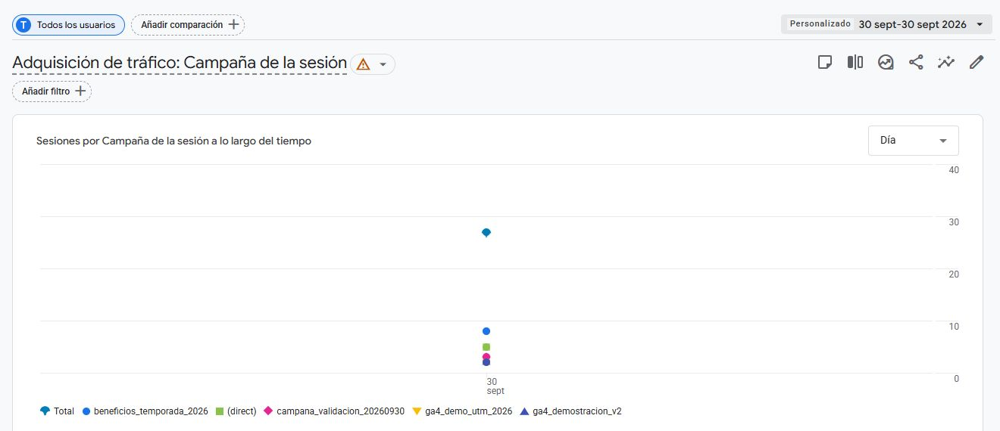

Gráfica nativa de sesiones por campaña. En esta consulta GA4 muestra cifras diferentes del corte transcrito en el manual; se conserva el periodo solicitado.

### A09 - Campaña: ingresos y eventos clave

**Sección:** 04 / Campaña identificada. **Periodo:** 30 sept 2026.

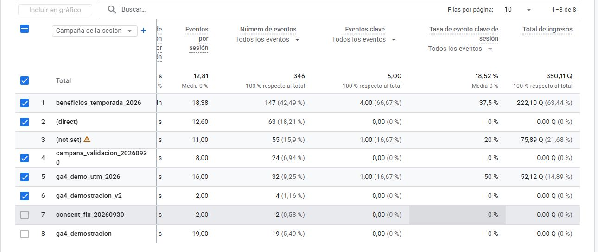

Consulta del 6 de octubre: beneficios_temporada_2026 Q222,10; total Q350,11. El manual conserva Q106,42 y Q144,98 respectivamente. Las capturas documentan el resultado actual para el mismo periodo.

### A10 - Campaña: sesiones y advertencia de atribución

**Sección:** 04 / Campaña identificada. **Periodo:** 30 sept 2026.

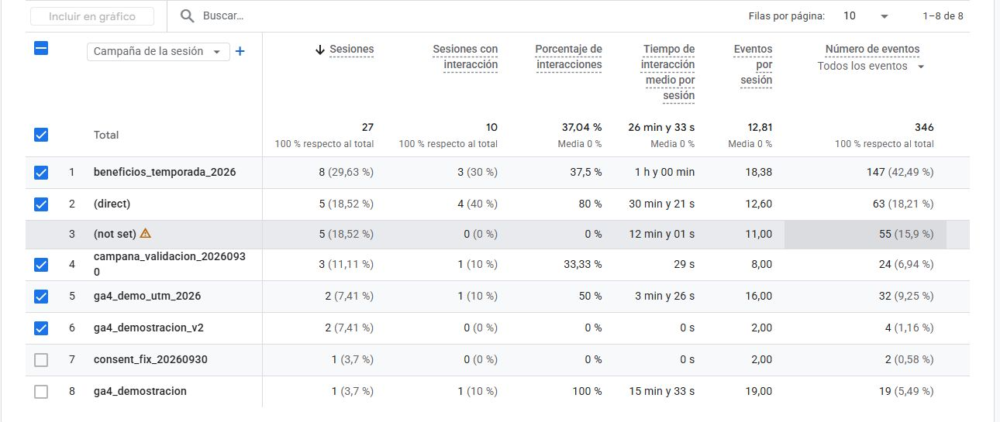

Consulta actual: 27 sesiones totales, 8 para beneficios_temporada_2026; se conserva visible la advertencia de (not set). El manual registra 21 y 2 en su consulta anterior.

### A11 - Segmentos: periodo y configuración de consulta

**Sección:** 05 / Segmentos y exploraciones. **Periodo:** 27 sept–2 oct 2026.

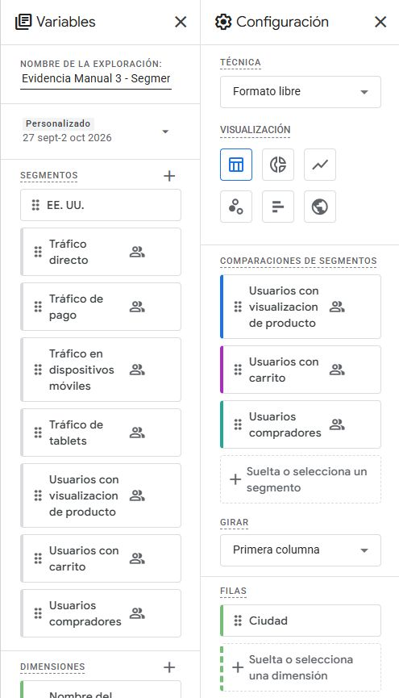

Copia personal de Exploracion 1 - Segmentos de usuarios. Se conserva la comparación de los tres segmentos y se muestra como tabla, la vista usada por el manual.

### A12 - Segmentos: comparación de usuarios activos

**Sección:** 05 / Segmentos y exploraciones. **Periodo:** 27 sept–2 oct 2026.

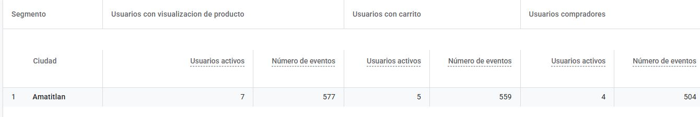

Resultado de la copia en la vista Tabla: 7 usuarios con visualización, 5 con carrito y 4 compradores. Son poblaciones de segmentos que se solapan; no se suman como usuarios únicos.

### A13 - Segmentos: cinco eventos guardados

**Sección:** 05 / Segmentos y exploraciones. **Periodo:** 27 sept-2 oct 2026.

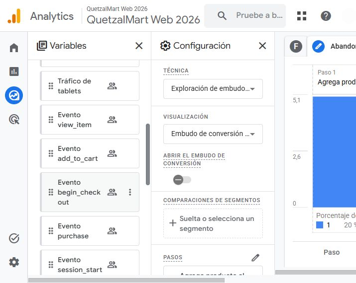

Lista nativa de los cinco segmentos citados por el manual: Evento view_item, Evento add_to_cart, Evento begin_checkout, Evento purchase y Evento session_start. Se desplazó el panel de variables de la copia de la segunda exploración; la captura de contexto del embudo acredita su periodo histórico.

### A14 - Audiencias: evolución de usuarios

**Sección:** 05 / Segmentos y exploraciones. **Periodo:** 4 sept-1 oct 2026.

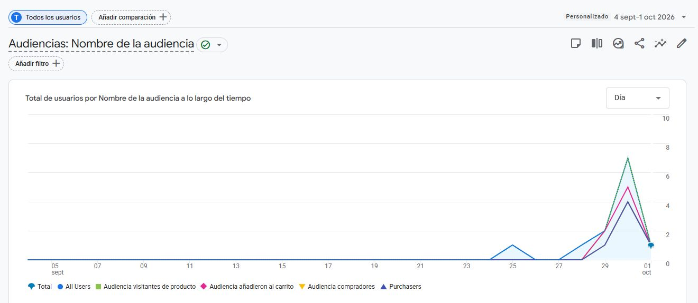

Informe histórico de las audiencias con datos en este período. La pertenencia a audiencias tiene su propia ventana; los grupos se superponen y sus ingresos no deben sumarse como ventas únicas.

### A15 - Audiencias: usuarios y sesiones

**Sección:** 05 / Segmentos y exploraciones. **Periodo:** 4 sept-1 oct 2026.

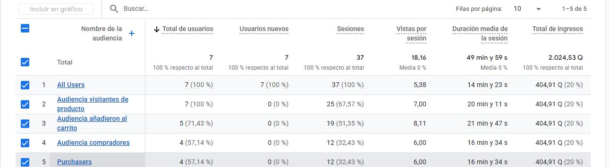

Las audiencias de visitas, carrito y compradores muestran 7, 5 y 4 usuarios. Las audiencias sugeridas y personalizada del manual se documentan por separado como configuración; la tabla no demuestra su población retroactiva.

### A16 - Audiencias: sugeridas y personalizada

**Sección:** 05 / Segmentos y exploraciones. **Periodo:** 27 sept-2 oct 2026; configuración consultada el 6 oct 2026.

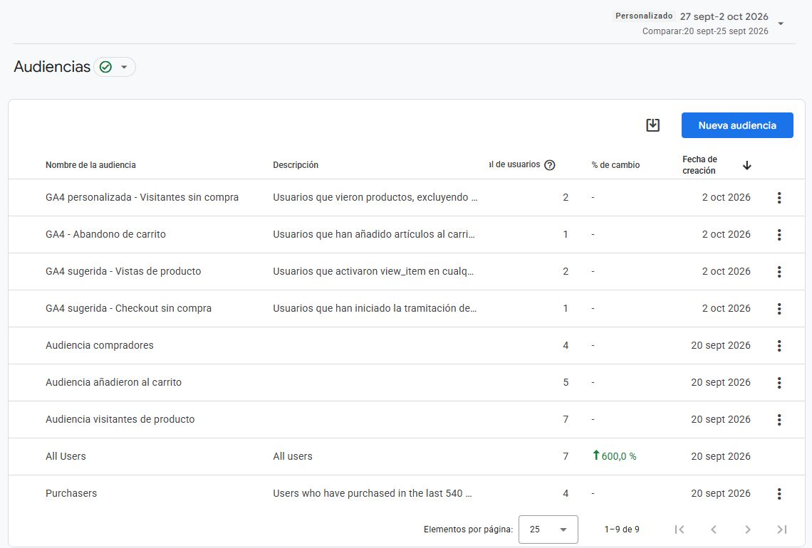

Se ven GA4 sugerida - Vistas de producto, GA4 sugerida - Checkout sin compra y GA4 personalizada - Visitantes sin compra, creadas el 2 de octubre. Esta captura acredita la configuración existente y su ventana de pertenencia; no equivale a recalcular segmentos antes de su creación. La comparación automática visible corresponde al 20-25 de septiembre.

### A17 - Embudo: periodo, pasos y resultado

**Sección:** 06 / Abandono y presentación. **Periodo:** 27 sept–2 oct 2026.

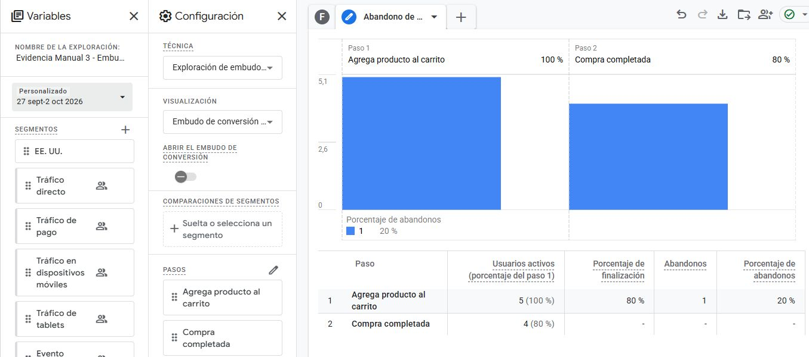

Copia personal de Exploración 2 - Eventos y abandono de carrito. Se conserva el embudo estándar cerrado Agrega producto al carrito → Compra completada y el periodo histórico del manual.

### A18 - Embudo: compras y abandono

**Sección:** 06 / Abandono y presentación. **Periodo:** 27 sept–2 oct 2026.

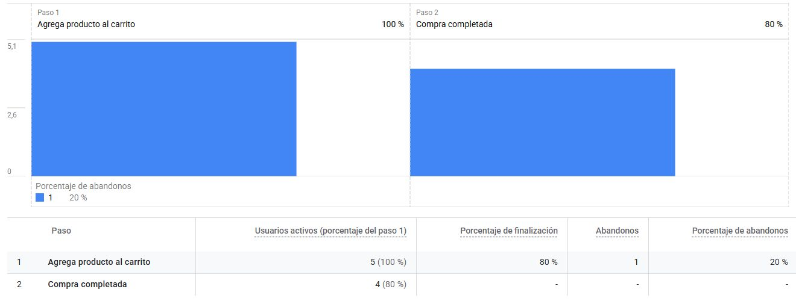

Coincide con el manual: 5 usuarios agregaron al carrito; 4 completaron compra (80 %); 1 abandonó (20 %). Es un embudo secuencial, no la resta de totales de eventos.
